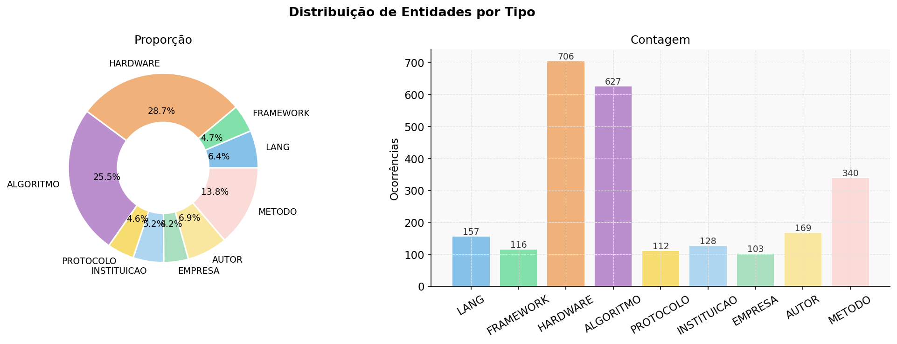
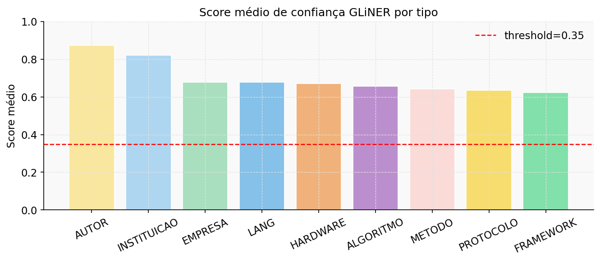
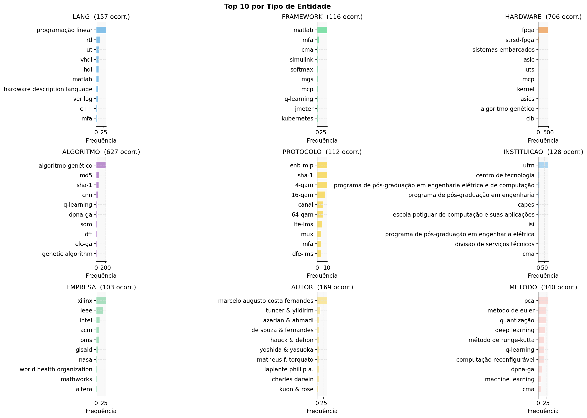
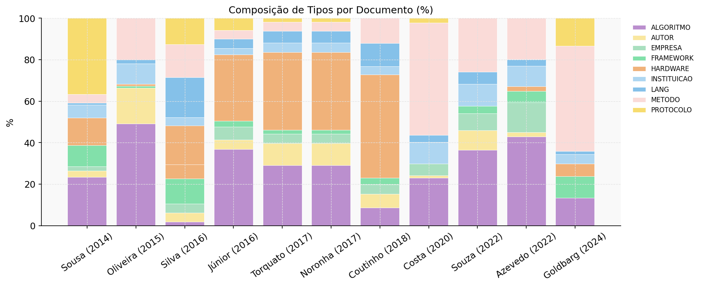
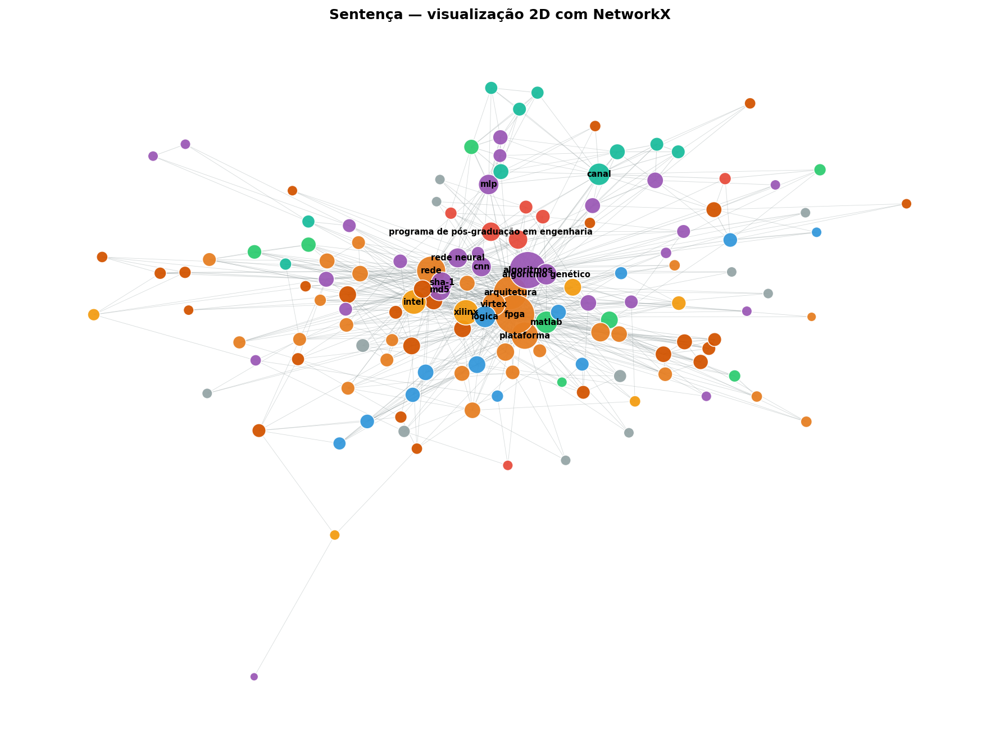
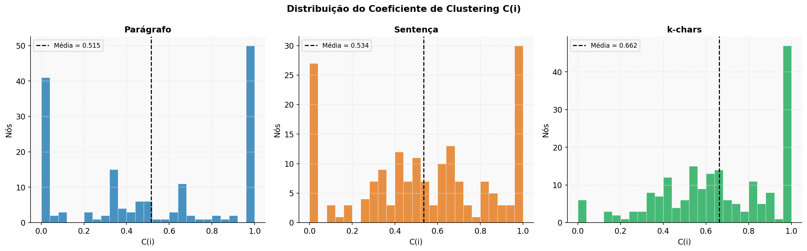

# Mapeando a Ciência: Análise de NER e Grafos no PPGEEC-UFRN

Este repositório apresenta um estudo sobre a estrutura intelectual e técnica das dissertações de mestrado do **Programa de Pós-Graduação em Engenharia Elétrica e de Computação (PPGEEC)** da UFRN. Através de Processamento de Linguagem Natural e Teoria de Grafos, exploramos como conceitos, tecnologias e instituições se conectam no universo acadêmico.

🎥 **[Assista à apresentação completa do projeto no Loom](https://www.loom.com/share/ec2adaeec1c34db5bf293ea2ee5adf81)**

---

## (i) Integrantes
- **Edivelton Rafaett Silva de Araújo**
- **Francisco Micarlos Teixeira Pinto**

## (ii) O Caminho Percorrido

O desenvolvimento deste projeto foi guiado por um pipeline de três etapas, cada uma focada em transformar textos brutos em conhecimento estruturado:

1.  **Imersão no Corpus (`notebooks/01_corpus_exploration.ipynb`)**: 
    Não nos limitamos a contar arquivos. Analisamos a densidade de informações das dissertações, validamos a qualidade da extração de texto via `PyMuPDF` e entendemos o perfil de cada documento. A análise de dispersão entre páginas e palavras confirmou a integridade dos dados processados.

2.  **Identificação de Entidades com Inteligência Artificial (`notebooks/02_ner_analysis.ipynb`)**: 
    Utilizamos o **GLiNER**, um modelo de ponta para Reconhecimento de Entidades Nomeadas (NER). Ensinamos o modelo a identificar o "ecossistema" do mestrado: linguagens de programação, frameworks, componentes de hardware, algoritmos e instituições. Validamos a precisão do modelo através da análise de *confidence scores*.

3.  **A Ciência das Conexões (`notebooks/03_graph_analysis.ipynb`)**: 
    As entidades sozinhas são apenas palavras. Ao construir grafos de coocorrência, mostramos como essas peças se encaixam. Testamos diferentes formas de definir "proximidade" (sentença, parágrafo e janela de texto) para entender qual delas melhor representa a relação real entre os conceitos.

## (iii) O que os Dados nos Dizem

### A Anatomia do Conhecimento e Confiabilidade
Nossa análise apontou que as dissertações do PPGEEC são ricas em termos de **Hardware** e **Algoritmos**. A IA demonstrou alta confiabilidade na identificação desses termos, com scores de confiança consistentes em todo o corpus.

*Figura 1: Panorama das categorias dominantes nas dissertações.*

*Figura 2: Nível de confiança do modelo NER por categoria.*

### Diversidade e Hubs
Percebemos que certas instituições e tecnologias funcionam como grandes pontes na rede. Além disso, a composição de entidades varia entre os documentos, refletindo a pluralidade de temas dentro do PPGEEC, desde pesquisas teóricas até implementações práticas de infraestrutura.

*Figura 3: Protagonistas terminológicos segmentados por categoria técnica.*

*Figura 4: Variedade do perfil terminológico entre as dissertações do corpus.*

### A Estrutura da Rede e Coesão
A análise da distribuição de grau confirma que a rede segue uma **Lei de Potência**, onde poucos nós (Hubs) concentram a maioria das conexões. O alto coeficiente de agrupamento (clustering) reforça a existência de comunidades temáticas coesas.

*Figura 5: A rede de conceitos técnicos conectada por sentenças.*

*Figura 6: Coeficiente de agrupamento evidenciando a formação de subgrupos técnicos.*

## (iv) Discussão e Insights Críticos

Ao observar as métricas de rede, encontramos evidências de um fenômeno de **Mundo Pequeno (Small World)**. Com um caminho médio baixo (entre 2.3 e 3.1) e um coeficiente de agrupamento alto, é evidente que o vocabulário técnico do PPGEEC é altamente coeso: um pesquisador de robótica e um de telecomunicações compartilham uma base comum de algoritmos e hardware.

**Insights sobre a Topologia**:
- **Robustez via Hubs**: A rede é ancorada em padrões universais, o que facilita a interdisciplinaridade dentro do programa.
- **Conectividade Global**: A presença de um componente gigante que engloba a maioria dos nós prova que o conhecimento no PPGEEC não é fragmentado, mas sim integrado.

**Comparação de Estratégias**:
-   **Sentença**: Gerou os grafos mais precisos e com maior fidelidade semântica (Clustering de 0.53).
-   **Parágrafo**: Captura um contexto mais amplo, mas tende a diluir a especificidade das relações.
-   **Janela de K-Caracteres**: A estratégia mais densa (Clustering de 0.66), ideal para mapear ferramentas citadas em conjunto.

---

## Estrutura do Projeto
- `notebooks/`: O cérebro do projeto.
- `data/`: Textos e entidades processadas.
- `figures/`: O acervo visual das descobertas.
- `results/`: Tabelas comparativas e métricas detalhadas.

## Como Reproduzir
1.  Crie o ambiente: `conda env create -f environment.yml`
2.  Ative: `conda activate ner_clean`
3.  Execute os notebooks na ordem numérica (`01`, `02`, `03`).
